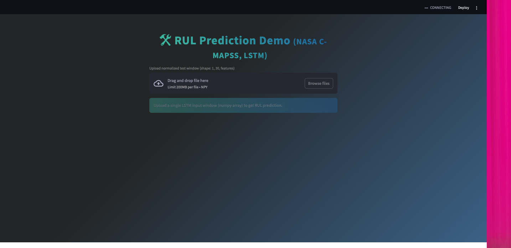

# GenAI4Manufacturing

**Predictive Maintenance with Generative AI: LSTM-based Remaining Useful Life (RUL) Prediction for NASA C-MAPSS Turbofan Dataset**

## 🚀 Project Overview

This repository demonstrates a modern AI workflow for predictive maintenance in manufacturing. It uses LSTM deep learning models to predict the Remaining Useful Life (RUL) of engines based on sensor data, with a beautiful Streamlit web UI for instant inference.

- **Dataset:** NASA C-MAPSS (FD001-004)
- **Tech Stack:** Python, TensorFlow/Keras, NumPy, Pandas, Streamlit, Conda (Apple Silicon/M1)
- **Features:** Full EDA, data preprocessing, training, validation, test pipeline, stylish web app, modular code.

---

## 📂 Directory Structure
GenAI4Manufacturing/
├── app/
│   └── streamlit_app.py
├── data/
│   ├── train_FD001.txt
│   ├── test_FD001.txt
│   ├── RUL_FD001.txt
│   └── ...
├── models/
│   ├── best_lstm.keras
│   ├── final_lstm.keras
│   └── best_lstm.h5
├── notebooks/
│   └── eda_and_training_demo.ipynb
├── scripts/
│   └── make_test_window.py
├── assets/
│   └── (optional images/plots)
├── README.md
├── requirements.txt
└── .gitignore
---

## ⚡️ Quickstart

1. **Clone the repo**
    ```sh
    git clone https://github.com/tahmid-al/GenAI4Manufacturing.git
    cd GenAI4Manufacturing
    ```

2. **Install dependencies**
    - Use Conda/miniforge on Mac M1:
        ```sh
        conda create -n ml_env python=3.10
        conda activate ml_env
        pip install -r requirements.txt
        ```
    - Or use your own environment and `pip install`.

3. **Train or load model**
    - Jupyter notebook: `notebooks/eda_and_training_demo.ipynb`
    - Pretrained model weights are in `models/`

4. **Run the Streamlit app**
    ```sh
    streamlit run app/streamlit_app.py
    ```

    > **Note:** Mac M1 users may need to use CPU-only mode and re-save model in their env due to TensorFlow/Protobuf issues.

---

## 🛠️ Features

- End-to-end workflow: EDA, preprocessing, windowing, normalization
- LSTM model for time-series RUL regression
- Model training, validation, and test set evaluation
- Streamlit app for real-time RUL prediction
- Modern UI: gradient background, styled outputs

---

## 📊 Results

- Best test RMSE (FD001): _XX.XX_ (fill in your best value!)
- See `notebooks/eda_and_training_demo.ipynb` for details and plots.

---

## 🖥️ Demo Screenshot



A modern Streamlit interface for instant Remaining Useful Life prediction.

---

## 💡 Troubleshooting

**Mac M1 / Apple Silicon Notes:**  
If you see `[libprotobuf FATAL ...]` errors, please:
- Use Python 3.9 or 3.10 (not higher)
- Force CPU-only mode in `streamlit_app.py`
- Re-save model with current TensorFlow version in your conda env

---

## 🤝 Credits

- Project by [Tahmid Al Kawsar Chowdhury](https://github.com/tahmid-al)
- Dataset: NASA Prognostics Data Repository ([link](https://www.nasa.gov))
- Special thanks to open source contributors and the AI community.

---

## 📄 License
[](https://opensource.org/licenses/MIT)
This project is for educational and research use.  
